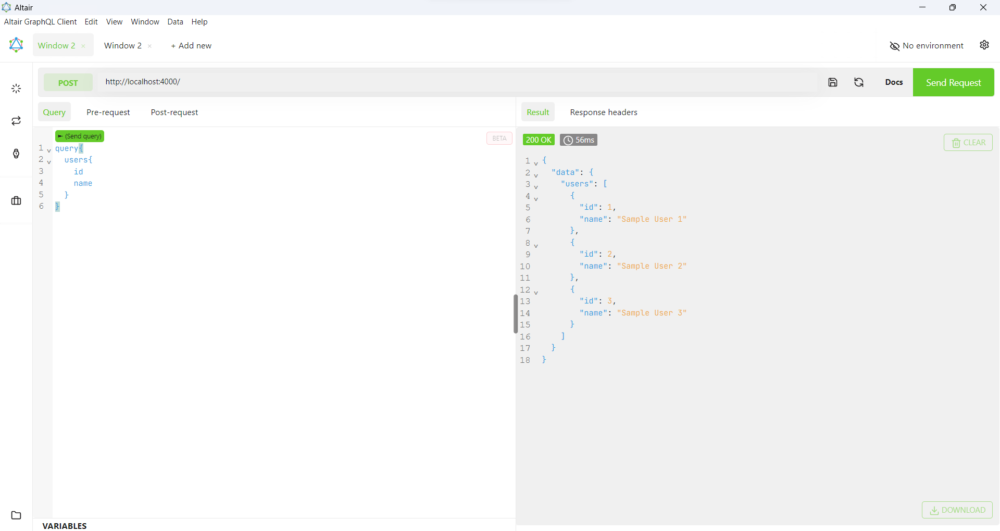
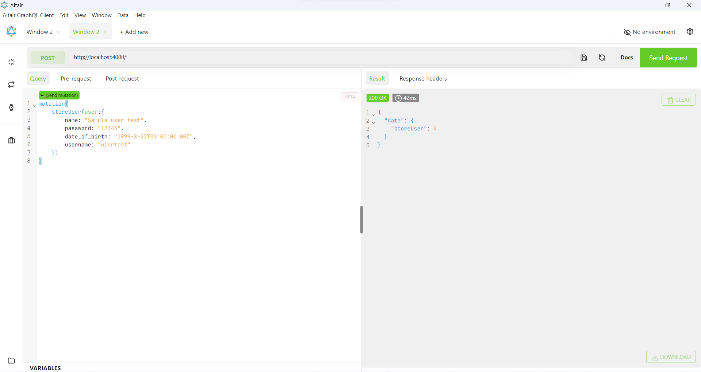

# E-commerce Mobile Application Backend

A simple mobile application backend using graphql with ballerina.

## Calling the endpoints

Url: `http://localhost:4000/`

* Get all users ( only id and name )
```
query{
  users{
    id
    name
  }
}
```


* Store a user
```
mutation{
    storeUser(user:{
        name: "Sample user test",
        password: "12345",
        date_of_birth: "1999-8-22T00:00:00.00Z",
        username: "usertest"
    })
}
```

